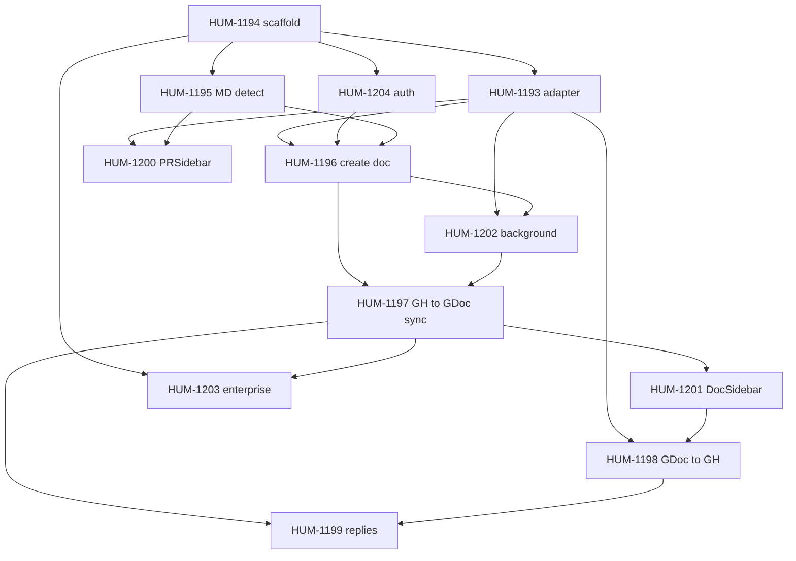

# Linear dependencies (for agents)

Agents **wait**, **poll**, and **sequence work** from dependency data. If Linear does not express blockers clearly, agents will start too early, wait on the wrong issues, or skip background polls.

**Read order for agents:**

1. **Linear issue relations** — `blockedBy` / `blocks` on the issue ([API](#how-agents-read-dependencies))
2. **Structured description** — `## Depends on` section (issue ids)
3. **[PRIORITIES.md](PRIORITIES.md)** — project dependency table (must stay in sync)
4. **[`.agents/claims.yaml`](../.agents/claims.yaml)** — runtime claims and `wait_queue.depends_on` (agent-maintained)

When these disagree, **fix Linear first**, then update PRIORITIES.md and any open `wait_queue` entries.

---

## Rules for every dorv issue

### 1. Set Linear “Blocked by” relations (required)

In Linear, open the issue → **Relations** → **Blocked by** → add every upstream issue that must be **done** (PR merged or issue closed) before implementation starts.

| Relation | Meaning for agents |
| --- | --- |
| **Blocked by** `HUM-1194` | Do not implement until HUM-1194 is `done` in claims / merged |
| **Blocks** `HUM-1196` | Inverse; set on the upstream issue when convenient |

Use **issue ids** (`HUM-####`), not vague labels like “auth” or “file detection”.

**Do not** use “Related to” for build ordering — agents ignore it for wait logic.

### 2. Add a `## Depends on` section in the description (required)

Put this **at the top** of the description (below the title line if you use one), so humans and agents see it immediately:

```markdown
## Depends on

- HUM-1194 — WXT scaffolding (manifest, permissions, build)
- HUM-1193 — SyncAdapter + storage types

**Blocks:** HUM-1197, HUM-1202 (downstream — do not edit manually if Linear relations are set)

## Spec

…rest of implementation detail…
```

**Format rules:**

- One bullet per blocker: `HUM-#### — short reason`
- Only **HUM-####** ids (regex: `HUM-\d+`). No “auth”, “sidebar”, or “TBD”.
- Optional **Blocks:** list for documentation (canonical block direction is still Linear **Blocked by** on the downstream issue).

### 3. Keep [PRIORITIES.md](PRIORITIES.md) in sync (required)

When you add or change dependencies in Linear, update the **Depends on** column and the suggested implementation order in the same PR or commit as doc changes (or immediately after creating the issue).

### 4. One downstream issue per blocker chain (recommended)

Avoid diamond confusion where possible. Prefer a **linear chain** for the critical path; document parallel work explicitly under **Can run in parallel with**.

---

## v0.1.0 dependency graph (canonical)

Set **Blocked by** on the right-hand issue for each row.

| Issue | Blocked by (set in Linear) | Notes |
| --- | --- | --- |
| HUM-1194 | — | Root scaffold |
| HUM-1193 | HUM-1194 | Adapter + storage |
| HUM-1204 | HUM-1194 | Auth (PAT + Google) |
| HUM-1195 | HUM-1194 | MD file detection |
| HUM-1200 | HUM-1193, HUM-1195 | PR sidebar UI |
| HUM-1196 | HUM-1193, HUM-1204, HUM-1195 | Create Google Doc |
| HUM-1202 | HUM-1193, HUM-1196 | Background worker |
| HUM-1197 | HUM-1196, HUM-1202 | GH → GDoc comment sync |
| HUM-1201 | HUM-1197 | Doc side panel |
| HUM-1198 | HUM-1193, HUM-1201 | GDoc → GH push |
| HUM-1199 | HUM-1197, HUM-1198 | Reply sync |
| HUM-1203 | HUM-1194, HUM-1197 | Ship / enterprise (last) |

**Parallel lanes** (after HUM-1194): HUM-1193, HUM-1204, HUM-1195 can run in parallel in separate worktrees.

**Close duplicate:** HUM-1192 — **Canceled in Linear**; no new dependencies on 1192.

### Mermaid (visual)



---

## New issue checklist

When creating a dorv Linear issue:

- [ ] **Blocked by** lists every upstream `HUM-####` (or none for roots)
- [ ] Description starts with **`## Depends on`** (machine-readable ids)
- [ ] **Milestone** set (e.g. v0.1.0)
- [ ] **Priority** set (Urgent vs High)
- [ ] **gitBranchName** / branch convention: `feature/hum-####`
- [ ] Row added or updated in [PRIORITIES.md](PRIORITIES.md)
- [ ] Downstream issues updated if this issue **blocks** them

---

## How agents read dependencies

### Linear API / MCP

```text
get_issue(id: "HUM-1196", includeRelations: true)
→ relations.blockedBy[]   # USE THIS for wait_queue.depends_on
→ relations.blocks[]      # downstream; informational
```

If `blockedBy` is **empty** but the description says “depends on auth”, treat the issue as **misconfigured**: do not guess — ask the user or fix Linear first.

### Description fallback

Parse the `## Depends on` section: extract all `HUM-\d+` tokens. Use only if `blockedBy` is empty and you are explicitly doing doc recovery.

### claims.yaml

When claiming or enqueueing wait:

```yaml
depends_on: [HUM-1193, HUM-1204, HUM-1195]  # must match Linear blockedBy
```

---

## Fixing existing issues (v0.1.0 backlog)

Several issues were created with dependencies only in prose or in PRIORITIES.md. **Humans should:**

1. Open each issue in the table above.
2. Add **Blocked by** relations to match the table.
3. Paste or update the **`## Depends on`** block in the description.
4. Confirm MCP `get_issue(..., includeRelations: true)` returns the expected `blockedBy` list.

Until Linear relations are set, agents should use [PRIORITIES.md](PRIORITIES.md) + description parsing but should comment on the issue that dependencies need to be wired in Linear.

---

## Related

- [AGENT_COLLABORATION.md](AGENT_COLLABORATION.md) — wait, poll (6 h), worktree, PR
- [PRIORITIES.md](PRIORITIES.md) — priorities and build order
