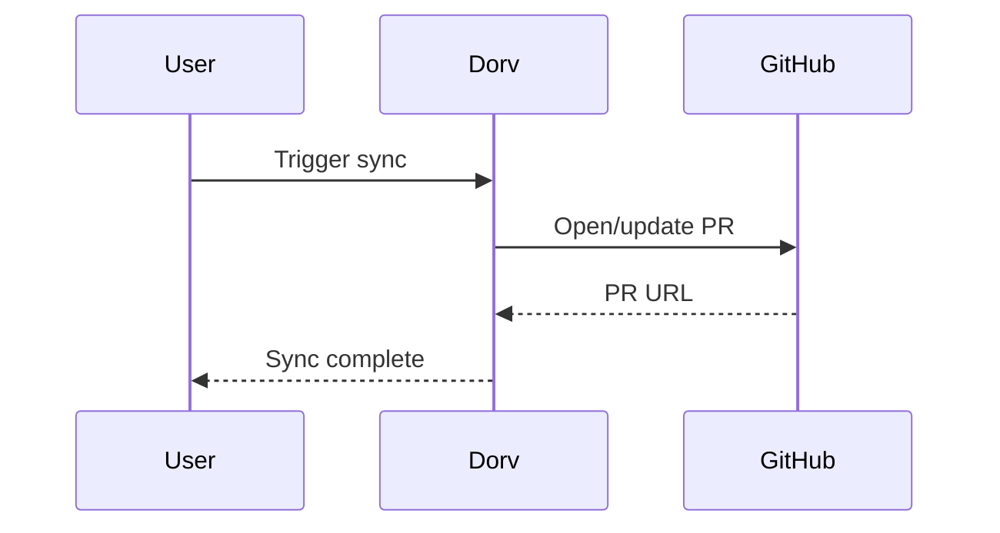

# Mermaid Diagram Fixture

Relevant to the v0.3.1 "Mermaid in comments" roadmap item: verifies
that fenced ```mermaid``` blocks round-trip through sync unmodified. Great


```mermaid
sequenceDiagram
    participant U as User
    participant D as Dorv
    participant G as GitHub

    U->>D: Trigger sync
    D->>G: Open/update PR
    G-->>D: PR URL
    D-->>U: Sync complete
```
